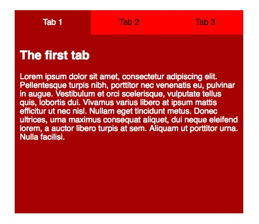
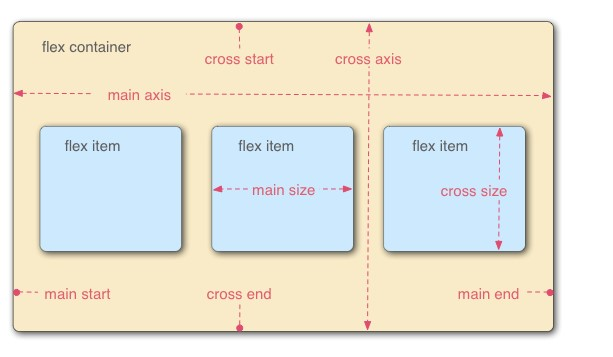

# 布局

_典型案例_

## 基础

默认布局是流动型，每个块从上一个块的新行排列，与块级元素本身定义有关，之后可以通过浮动(float)、定位(position)、z-index进行布局

## 部分知识

### 溢出overflow

当内容溢出元素框时的情况。

* visible，默认，内容超出出现元素框外。
* hidden，内容被剪，超出内容不可见。
* scroll，内容也被被剪，但提供滚动条查看。
* auto，根据内容是否增加滚动条。

### 可调尺寸resize

默认none无法调整，both可调，horizontal可调宽度，vertical可调高度。

```
div {border: 2px solid; padding:10px; width: 100px; resize: both;}
```

### box-sizing

包括content-box(内容框)、border-box(边框盒)，前者的边框和内边距会附加到元素上，后者的边框和内边距计算在元素内。(不包括外边距margin)，通常使用border-box更加方便。

```
div {box-sizing: border-box;}
div {box-sizing: border-box; border: 1px solid;}
```

### outline-offset

对轮廓进行偏移，并对边框边缘绘制，规定轮廓线与轮廓内容框距离。(轮廓并不占用空间，亦可为非矩形)

```
div {outline: 1px solid black; outline-offset:10px;}
```


## 布局实战

### 消息盒子



制作如上图的列表消息盒子时。

**构成方式**

**HTML**：分为两栏，tab位和内容位，tab位用ul和li布局，内容位可以使用artile，编写。

**CSS**：CSS先字体、border-box边框盒，去外内边距等日常操作，然后从外而内、从上往下设置，总框设置宽高，tab位内的li使用浮动并设置好宽度。为可以跳转使用链接方式，并为inline-block布局，(记得清除浮动)，内容位外层设置高度以及绝对定位即可，具体的article为相对定位，

### [滑动隐藏的侧边栏](https://mdn.github.io/learning-area/css/css-layout/practical-positioning-examples/hidden-info-panel.html)

#### label与input

label表示用户界面某个元素的说明，通过label的for与input的id属性进行联用，也可以将input直接放label里面。

```
<label for="text">123</label>
<input type="checkbox" id="text">
或
<label>123 <input type="checkbox" name="123"> </label>
```

#### transition

不同状态切换的过渡效果（仅仅是过程），需要规定CSS属性与时长（秒/毫秒），还可以规定速度效果、开始时间。通常以:hover，:active或JavaScript实现状态变化。

```
div{width:100px; height:100px; background:yellow; transition: width 2s,height 2s;}
div:hover{width:200px; height:200px; transform:rotate(180deg)};
```

* transition-timing-function：过渡效果的速度曲线。

  linear：相同速度到结束，ease：慢速—快—慢—结束，ease-in：慢速开始.，

  ease-out：慢速结束，ease-in-out：慢速开始和结束，cubic-bezier(n,n,n,n)：自定义0-1。

* transition-delay：开始前的等待时间。

滑动隐藏的侧边栏即为**checkbox hack**技术，通过label和input及css即可提供无JavaScript的方法控制元素，

可用css隐藏复选框，通过绝对定位或者透明度为0，HTML使用label与input的联合用法，CSS设置为：

```
label[for="text"]{position:absolute; top:4px; right:5px; z-index:1; cursor: pointer; }
input[type="checkbox"]{position:absolute; top:-100px;}
```

**滑动面板**

```
aside{background: ; color: ; width: ; height: ; padding: ; position:fixed; top:0px; right:-370px; transition: 0.6s all;}
```

将这些的设置放入CSS底部，使用:checked伪类，

```
input[type=checkbox]:checked+aside {right:0px;}
```

也可使用下面的方式过渡，只是暂时出现。

```
aside:hover{margin-right:340px;}
```

## 弹性盒子

值得一提的是，对于需要兼容部分旧版本的浏览器，弹性盒子可能不太适合。[flexbox新的语法](https://css-tricks.com/old-flexbox-and-new-flexbox/)

#### flexbox



* 主轴（main axis）：沿flex元素放置方向的轴，开始与结束为main start和main end。
* 交叉轴（cross axis）：垂直于flex元素放置的轴，开始与结束为cross start和cross end。
* display: flex又称flex容器，其内表现为柔性盒子的元素即为flex项。

```display:flex``` 即可设置为从左到右排列，```flex-direction: column```即可设置从上到下排列，其他还有row-reverse、column-reverse反向排列。

```
flex-wrap: wrap;
```

溢出的元素移到下一行，

```
flex: 200px;
```

设置每个块最小为200px。

```
flex-direction: row; flex-wrap: wrap;可换为 flex-flow: row wrap;
```

* 动态尺寸

```
article{flex: 1 200px;}
article:nth-of-type(3){flex: 2 400px;}
```

首先分配200px空间，然后按比例分配，如果起始空间大，则按比例削减。

* 数值写法：单值可为宽度值/无单位数，双值第一个为无单位数，第二个为无单位/宽度值，三值为无单位数、无单位数、宽度值。
* 对齐方式：align-items控制交叉轴（flex-start轴起点，flex-end轴终点，center居中，left、right、stretch等等），justify-content控制flex在主轴位置（start、flex-start、flex-end、center、left、right、space-between、space-around等等）。
* 排序oreder：默认会按order增量排序，从小到大。
* 可嵌套。
* 如果需要盒子高度自动，可以设置``align-items: flex-start;``

flexbox极其简单的居中布局``display: flex; align-items: center; justify-content: center``。

## 响应式布局

通过获取浏览器窗口大小来做响应式布局。[媒体查询](https://developer.mozilla.org/en-US/docs/Web/CSS/Media_Queries/Using_media_queries)

```
@media screen and (min-width:600px) {
nav {
    float: left;
    width: 25%;
    }
section {
    margin-left: 25%;
    	}
}
@media screen and (max-width:599px) {
nav li {
    display: inline;
       }
}
```


## 一些布局细节

* li改为inline制作成水平菜单。

* 居中与小窗口问题
  * marign:0 auto;常用的水平居中方式，通过占据指定的width，剩下的宽度一分为二为左右外边距。
  * max-width取代width可以适应浏览器处理小窗口的情况，手机端等显得很重要。

* 盒模型的外边距、内边距与宽度计算问题

不再计算，采用box-sizing的属性，设置box-sizing:border-box时内外边距不会增加宽度了，也可以全局使用。（记得加上-webkit-  -moz-box- 来去使用旧版本的浏览器。）

* position定位与float浮动见[task5_note](https://github.com/wen1ling/ife.baidu_notes/blob/master/%E9%9B%B6%E5%9F%BA%E7%A1%80_task5/task5_note.md)
* float：设置后的会脱离文档流，实现图片的文字环绕
* ``display: inline-block``可以代替float实现可能需要的多个块的要求，inline-block行内块，vertical-align会影响它，值设置为top，需要设置某一列宽度，元素之间有空格，列之间会有空隙。

**较为新的一些样式**

* 文字的多列布局，

```
.there-column {padding:1em; column-count:3; column-gap:1em;}  
```

* width的calc()使用，

计算规则：+、-、*、/，可以混用单位，+、-时前后必须有空格，其他建议，版本要求较高，须加浏览器识别符。

## 更多布局问题

### float

* 设置float的元素会脱离文档流，即脱离本身所在的块，但是会对内容紧凑。

### 布局方式

* 双飞翼布局

* BFC声明：overflow、inline-block、table-cell。
* margin负值法，

1. [MDN](https://developer.mozilla.org)
2. [learnlayout](http://zh.learnlayout.com)

3. [定位及z-index](https://www.cnblogs.com/chaixiaozhi/p/8481253.html)


> [MDN布局](https://developer.mozilla.org/zh-CN/docs/Learn/CSS/CSS_layout/Practical_positioning_examples)


